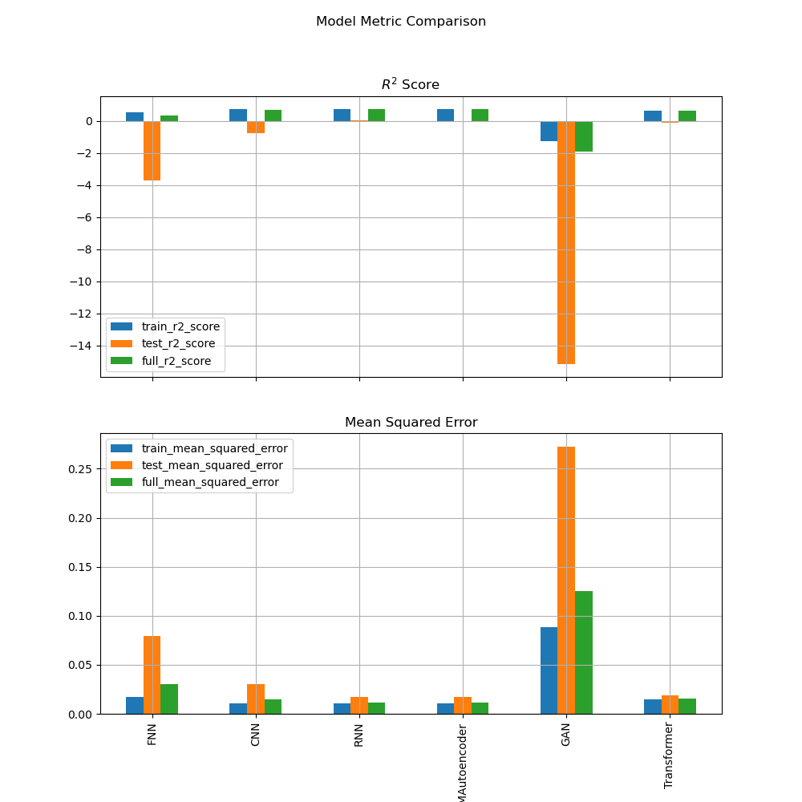
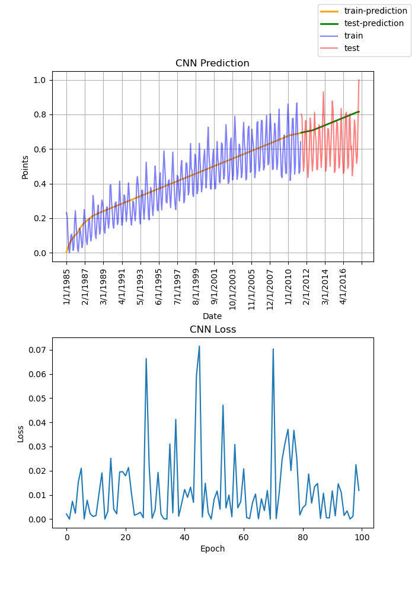
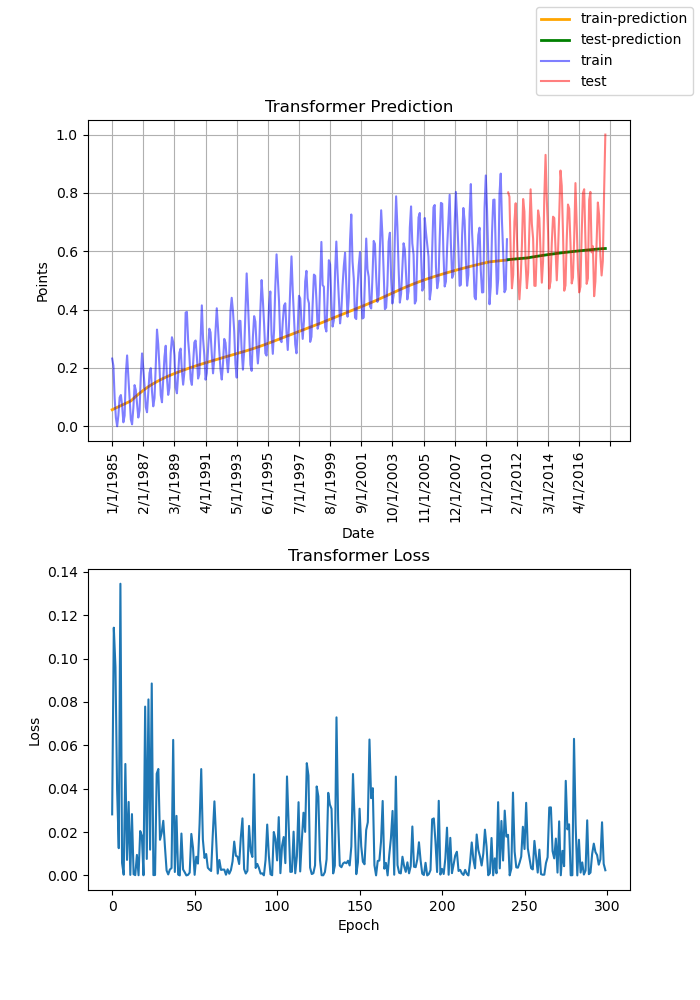

# Quiz 2 - Final Report
Wyatt Blair

DUE: 5/5/2024
___
# Model Implementations

* [--> Summary Notebook](CS583_Quiz2_WyattBlair.ipynb)
* [Feed-Forward Neural Network](models/fnn.ipynb)
* [Convolutional Neural Network](models/cnn.ipynb)
* [Recurrent Neural Network](models/rnn.ipynb)
* [Long-Short Term Memory Autoencoder](models/autoencoder.ipynb)
* [Generative Adversarial Network](models/gan.ipynb)
* [Transformer](models/transformer.ipynb)

___
# Results

## Model-Comparison

___
# Conclusions
## General

Overall, there were only two models which did not have abysmal $R^2$ scores in the test set. Those models were the AutoEncoder and the Recurrent Neural Network; with the Transformer falling into an honorable mentions category. 

The GAN was by far the worst performing model, struggling to even find a solution which was not just the average value of the dataset.

Across the board all models struggled to capture the oscillatory nature of the dataset. A shortcoming which could likely be improved with better data preprocessing and output interpolation. 

I think also the loss functions are quite telling. Some found a good solution very early on and then meandered around that minimum for the entire training session. Other's went through periods of having great solutions to having terrible solutions, while other's still never found a good solution at all. 

Why these models had such a variety of behaviors is covered in the Model Specific section below, which dives into the mathematical reasoning behind each model's performance.
___
## Model Specific
### FNN

#### Equation
$f_l(X_l) = a_l(w_l^T \cdot X_l); \forall{l} \in \text{hidden-layers}$

$l :=$ hidden layer index 

$X_l :=$ input data which has been  transformed by $(l-1)$ hidden layers

$a_l :=$ activation function for layer $l$

$w_l :=$ weights for hidden layer $l$

#### Description

The Feed-Forward Network did a decent job predicting the data, however it struggled to capture the non-linear aspects of the data. This is because, without proper preprocessing of this oscillatory data, a linear network can only capture a linear trend in the data. The mathematical model demonstrates this linearity in the dot-product operation between $w_l$ and $X_l$. 

#### Result

___

### CNN

#### Equation
$G[m, n] = (f*h)[m,n] = \sum_j{\sum_{k}{h[j,k]f[m-j, n-k]}}$

$f :=$ input image

$h :=$ kernel

$m, n :=$ matrix indices

$G :=$ resulting feature map

#### Description

The 1D Convolutional Neural Network uses a sliding kernel to activate neurons depending on the values of the neighboring sequence elements. The act of applying this sliding kernel is a simple matrix multiplication, as indicated by the equation above. By tying the activation of the neurons to the values of neighboring elements of the sequnce, the model can gain inference power to better predict the time series data. This resulted in better scores when compared to the FNN and GAN model.

#### Result

___

### RNN

#### Equation
$h_t = f_W (h_{t-1}, x_t)$
        
$h_t :=$ new state

$f_W :=$ function with parameters $W$

$h_{t-1} :=$ previous state

$x_t :=$ input vector at time step $t$

#### Description

A recurrent neural network (RNN) has many hidden layers, each of which is activated by a previous layer. This mathematically recurring connection in the model both gives the model its name and gives the model the capactiy to "remember" previous sequence elements. 

This capacity to "remember" is exactly why the model out performs practically all other models I tested. RNNs are often used for time-series data predictions and so it makes sense why it performed so well here.

#### Result

___

### AutoEncoder

#### Equation
$E_\phi: \mathscr{X} \xrightarrow{} \mathscr{Z}$

        
$z = E_\phi(x)$

$D_\theta: \mathscr{Z} \xrightarrow{} \mathscr{X}$

$x' = D_\theta(z)$

$E_\phi :=$ encoder, parameterized by $\phi$

$D_\theta :=$ decoder, parameterized by $\theta$ 

$x :=$ input message 

$z :=$ latent code 

$x' :=$ decoded message

#### Description

An Autoencoder takes a sequence in as input, encodes that sequence into a feature space, and then runs the feature vector through a decoder to obtain the output sequence. Doing so, extracts the "essence" of the input sequence vector and connects it to the desired output sequence vector. The goal in training one of these models is to create a feature space which captures the relationship between input and output correctly. 

The model performed particularly well, meaning the mathematical feature space it created was sufficiently robust enough to form a connection between input and output that extended beyond the train set and into the test set.

#### Result

___

### GAN

#### Equation
##### Discriminator Weight Gradient
$\nabla_w D_w = \frac{1}{m} \sum_{i=1}^{m}[\log{D_w(x_i)} + \log{(1 - D_w(G_\theta(z_i)))}]$ 

        
$w :=$ weights of the discriminator 

$\theta :=$ weights of the generator 

$m :=$ number of samples in mini-batch 

$D_w :=$ discriminator using weights $w$. Output restricted to $[0, 1]$, indicating whether the discriminator believes the given image, $x$, is fake or real. 

$G_\theta :=$ generator using weights $\theta$. Output is an image which is designed to trick the discriminator. 

$x :=$ an image in the discriminator's input space 

$z :=$ a feature vector in the generator's input space 

##### Generator Weight Gradient

$\nabla_\theta G_\theta = \frac{1}{m} \sum_{i=1}^{m}{\log{(1 - D_w(G_\theta(z_i)))}}$

Please refer to the Discriminator section above for a description of the variables.

#### Description

A Generative Adversarial Network (GAN) is actually two models (the generator and the discriminator) competing against one another. These models have intertwined loss functions which influence the backpropagation through their networks and essentially pits the models against one another. I was unable to get the GAN to produce reasonable results, meaning the min-max competition, captured mathematically in the respective loss functions of the discriminator and generator, was not sufficient eneough to produce gradients for the generator to create good output prediction sequences.

#### Result

___

### Transformer

#### Equation
$\text{Attention}(Q, K, V) = \text{softmax}(\frac{QK^T}{\sqrt{d_k}})V$ 

$Q :=$ Query matrix 

$K :=$ Key matrix 

$V :=$ value matrix 

$d_k :=$ number of dimensions

#### Description

Transformers are designed to be sequence to sequence models, meaning it was expected to perform pretty well. Even though the model did not perform that well on the test-set, it did outperform almost every other model (except for Autoencoder and RNN). The transformer model found the optimal query, key, and value matrices to capture relationships between important members of the sequence, be they neighbors or otherwise. This means the 10th element of a sequence may be influenced heavily by the 5th element of that sequence, if the transformer's query, key, and value matrices highlighted that element. 

Even though the transformer placed third, it was pretty close to tying for first, so I'd say it performed pretty well.

#### Result

___
# Next Steps
## Data Preprocessing

The oscillations in this dataset proved difficult for the models to train on outright. As such, one possible remedy would be to first Fourier Transform the dataset so that instead of predicting values in "IPG2211A2N index" space, the model is trained on the features of the equivalent "Frequency" space. 

Doing so would almost certainly improve the results, however I ran out of time before I could implement that.

## Interpolation

Another possible remedy to the oscillation problem would be to better interpolate the output of the data. All these models are operating effectively as sequence-to-sequence. Which means in order to get just a single prediction output for each sequence I need to interpolate a number of output sequences.

Currently, that interpolation looks like a smoothing / averaging across all sequences overlayed on one another. However, I am certain their are better methods out there which could improve the final predictions of these models. 

## GAN

The GAN was the worst performing model and could have benefitted from some more time. If I had the time, I'd first play with the "g_lr" and "d_lr" learning rate parameters I created. Finding an optimal ratio could perhaps provide the gradients necessary for the GAN to start performing better.

## Sequence Length Experiments

I trained all of these models on a fixed sequence length of 16. If I had more time, I'd experiment with other sequence lengths and see how that affects the results.